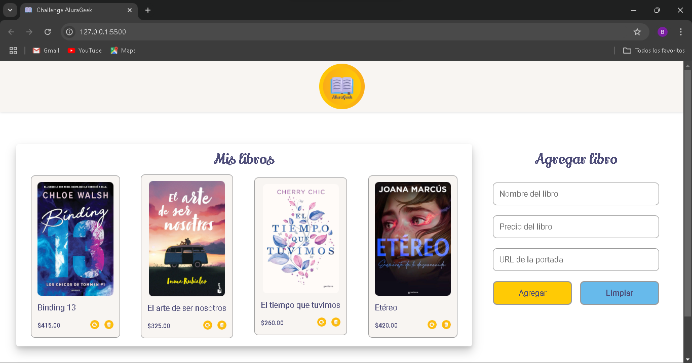
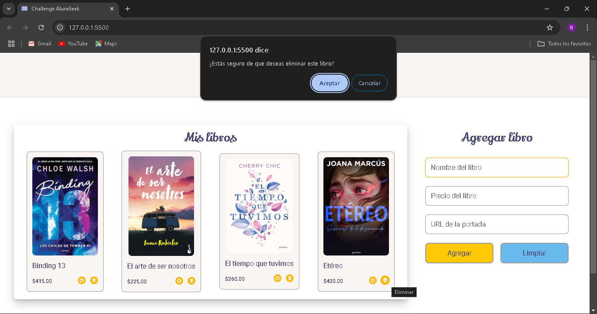
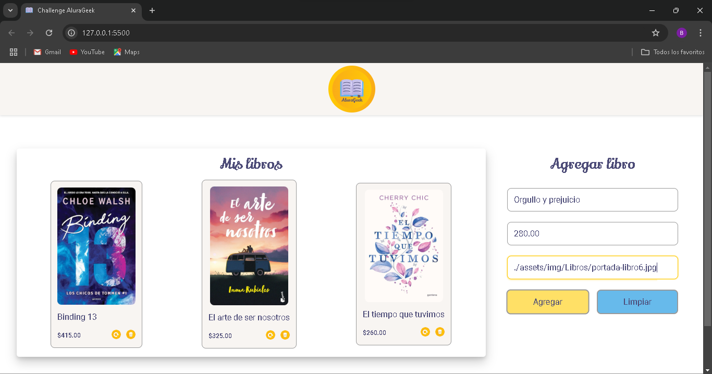
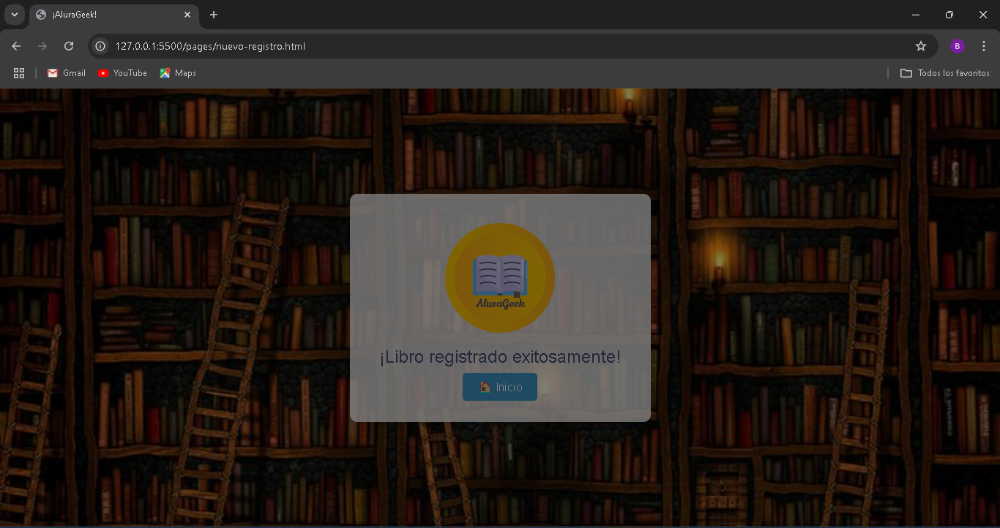
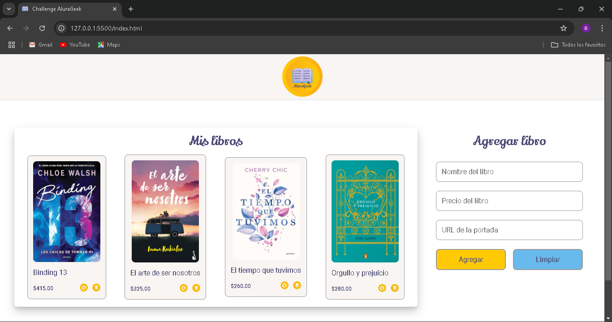
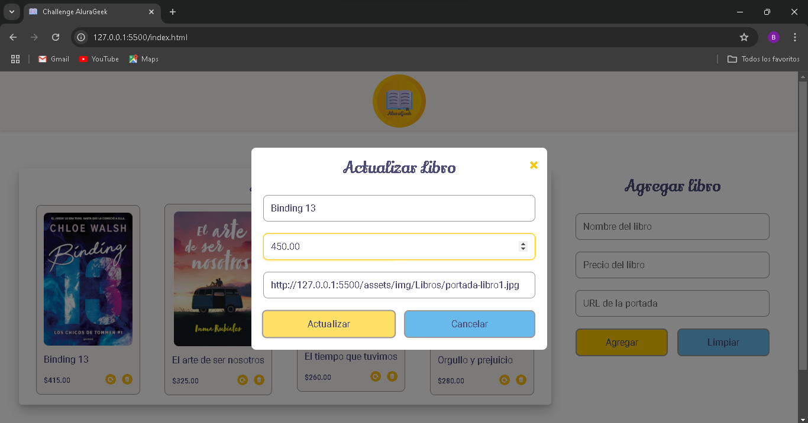

# Challenge AluraGeek

<p>Proyecto realizado como parte del curso de especialización Frontend en Alura Latam y Oracle Next Education. Consiste en una plataforma de comercio electrónico ficticia para practicar el desarrollo de interfaces responsivas, dinámicas y conectadas a un servidor simulado.</p>

##### Características
- Diseño responsivo y accesible para cualquier dispositivo.
- Simulación de CRUD (Crear, Leer, Actualizar y Eliminar productos).
- Manejo de rutas dinámicas para simular navegación entre páginas.
- Validación de formularios en tiempo real.

##### Tecnologías utilizadas
- HTML
- CSS
- JavaScript
- NodeJS
	- JSON Server

##### Cómo Usar el Proyecto
1. Clona el repositorio
```
git clone https://github.com/Belen343/challenge-AluraGeek.git
```
2. Instala las dependencias necesarias
```
npm install
```
3. Inicia el servidor JSON Server
```
npx json-server --watch db.json --port 3001
```
4. Abre el archivo index.html en tu navegador o utiliza una extensión de servidor local como "Live Server".

##### Capturas de pantalla
###### Página principal


###### Funcionalidad de eliminar


###### Funcionalidad de crear




###### Funcionalidad de actualizar


##### Créditos
<p>Este proyecto fue desarrollado como parte del Challenge Frontend de Alura Latam en colaboración con Oracle Next Education (ONE) por Ing. Belen Hernández Virgen</p>
